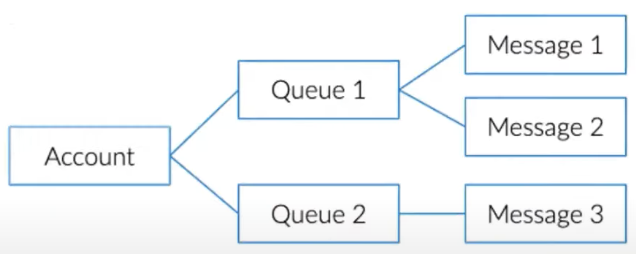

# Day 1 - Data Lake

[TOC]

## Categories of Data

We can category data into two different categories:

- Data storage
  - Azure Storage Accounts
  - Azure Data Lake
  - Azure Cosmos DB
  - Azure SQL
- Data Transformation
  - Azure Data Factory
  - Azure Stream Analytics
  - Azure Databricks
  - Azure HDInsight
- Azure Synapse Analytics

We have another data classification:

- Structured data
  - SQL data, Tabular data, csv
- Semi-structured data
  - NoSQL, JSON, XML, YAML
- Unstructured data
  - Media files, Office files, Log files

## Cloud

The practice of using a network of remote servers hostsed on the internet to store, manage, and process data, rather than a local server or personal computer.

- Infrastructure as a service (IaaS)
  - You rent a virtual server
  - Amazon, Azure, GCP, etc.
- Platform as a service (PaaS)
  - You rent an abstract machine
  - Google app engine, Saleforce, etc.
- Software as a service (SaaS)
  - You rent a capability
  - Azure SQL, ADF, etc.

We need a solution which can handle below 4 V's of data.

- Volume: huge data size
- Velocity: high speed of data flow change and processing. For real-time system we use apache kafka. For batch systems we use OLAP.
- Variety: various data sources (social, mobile, M2M, structured and unstructured data)
- Veracity: various levels of data uncertainty (uncertainty and reliability)

## Azure Storage Accounts

Azure storage is a Microsoft-managed cloud service that provides storage that is highly available, secure, durable, scalable and redundant. Within Azure there are two types of storage accounts, four types of storage, four levels of data redundancy and three tiers for storing files.

An [Azure storage account](https://learn.microsoft.com/en-us/azure/storage/common/storage-account-overview) contains all of your Azure Storage data objects: ***blobs***, ***files***, ***queues***, and ***tables***. The storage account provides a unique namespace for your Azure Storage data. Data in your storage account is durable and highly available, secure, and massive scalable. 

### Azure Storage

- Azure File Storage

  - Azure Files is a ***shared*** network file storage service that provides administrators a way to access native SMB file shares in the cloud.

    

- Azure Queue Storage

  - Azure Queue Storage is a service that allows users to store high volumes of messages (to build messaging system), process them asynchronously and consume them when needed.

    

- Azure Table Storage

  - Azure Table Storage is a scalable, NoSQL, ***key-value*** data storage system that can be used to store large amounts of data in the cloud. This storage offering has a schema less design, and each table has rows that are composed of key-value pairs.

    

- Azure Blob Storage
  - Azure Blob Storage is Microsoft Azure's service for storing ***binary large objects*** or blobs which are typically composed of unstructured data such as text, images, and videos, along with their metadata. Blobs are stored in directory-like structures called "containers".
  - Large objects storage in cloud.
  - Optimized for storing massive amounts of unstuctured data
    - text or binary data
  - General purpose object storage
  - Cost efficient
  - Provide multiple tiers

### Azure Service Hierarchy

### Azure Data Lake Gen 2

Data Lake Gen 1 is actually a replica of ***Hadoop***. They lifted it from the on-premise from the open source and they have shifted it to the cloud as Data lake Gen 1. Now they integrated it with Blob Storage since it has other features like access tiers, right redundancy, lify cycle policies etc.

In Azure (Blob) Storage we just need to enable the `Data Lake Storage Gen2` checkbox `Enable hierarchical namespace`. Then we can leverage all the features from the Blob storage and on top of it use Data Lake Gen 1. We are then able to use Data Lake Gen 2.

In Data Lake Gen 2 we have `Add Directory`  and `Access Control List` while in Blob Storage we don't have these.

#### Hierarchical namespace

#### Data Ingestion

#### Concepts of Data Lake

- Access tiers
  - **Hot**: optimized for storing data that is accessed ***frequently***.
  - **Cool**: Optimized for storing data that is ***infrequently*** accessed and stored for at least 30 days (***early deletion fee***).
  - **Archive**: Optimized for storing data that is ***rarely*** accessed and stored for at least 180 days with flexible latency requirements, on the order of hours (***early deletion fee***).
    - To read data in archive storage, you must first change the tier of the blob to hot or cool. This process is known as ***rehydration*** and can take hours to complete.
      - **Standard priority**: The rehydration request will be processed in the order it was received and may take up to 15 hours.
      - **High priority**: The rehydration request will be prioritized over Standard requests and may finish in under 1 hour for objects under ten GB in size.
- Security: access keys, sas tokens, active directory, role-based access controls, access control lists (folder level access), data encryption techniques.
- Life Cycle policy
- Redundancy: used for disaster recovery. Local redundant, zone redundant, geo redundant
- Monitoring services