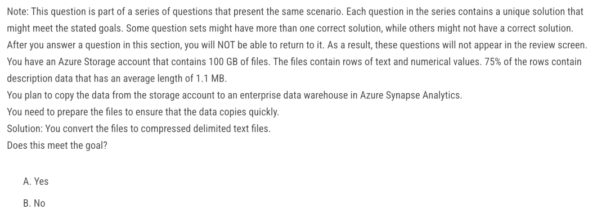
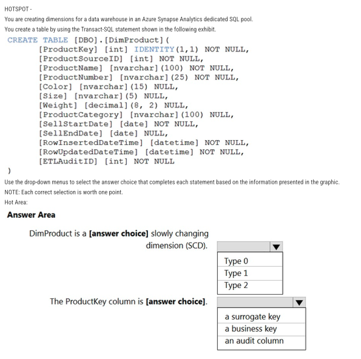

[TOC]

## Topic 1

### 1.


Reference: https://learn.microsoft.com/en-us/analysis-services/tabular-models/hierarchies-ssas-tabular?view=asallproducts-allversions

https://learn.microsoft.com/en-us/sql/t-sql/data-types/int-bigint-smallint-and-tinyint-transact-sql?view=sql-server-ver16&viewFallbackFrom=sql-server-

Correct Answer: C

#### Different data types (int)

| Data type |            Range            | Range expression | Storage |
| :-------: | :-------------------------: | :--------------: | :-----: |
|  bigint   | about -9\*10^18 to 9\*10^18 | -2^63 to 2^63-1  | 8 Bytes |
|    int    |  about -2\*10^9 to 2\*10^9  |  -2^31 to 2^31   | 4 Bytes |
| smallint  |      -32,768 to 32,767      | -2^15 to 2^15-1  | 2 Bytes |
|  tinyint  |          0 to 255           |  2^0-1 to 2^8-1  | 1 Byte  |

The **int** data type is the primary integer data type in SQL Server. The **bigint** data type is intended for use when integer values might exceed the range that is supported by the **int** data type.

`ManagerEmployeeKey` should match the Data type of `EmployeeKey` which is INT. And smallint may not  be enough range. `ManagerEmployeeKey` is a foreign key in the `DimEmployee` table connected to the primary key of the `DimManager` table. This column can be null because an employee can be a manager and there is no one she/he is reporting to.

#### Dimension/fact table

- **Fact tables** are tables whose records are **immutable "facts"**, such as service logs and measurement information. Records are progressively appended into the table in a streaming fashion or in large chunks. The records stay there until they're removed because of cost or because they've lost their value. Records are otherwise **never updated**.
  - Entity data is sometimes held in fact tables, where the entity data changes slowly.

- Dimension tables:
  - Hold reference data, such as loopup tables from an entity identifier to its properties.
  - Hold snapshot-like data in tables whose entire contents change in a single transanction.
  - Dimension tables aren't regularly ingested with new data.

**Continuous export** jobs must differentiate between fact tables and dimension tables. Fact tables only process newly ingested data, and dimension tables are used as lookups. As such, the entire table must be taken into account.

### 2.


Reference: https://learn.microsoft.com/en-us/azure/synapse-analytics/metadata/table#create-a-managed-table-in-spark-and-query-from-serverless-sql-pool

https://learn.microsoft.com/en-us/azure/synapse-analytics/sql/develop-storage-files-spark-tables

Correct Answer: A

#### Apache Spark pools

Azure Synapse Analytics allows the different workspace computational engines to share databases and tables between its Apache Spark pools and serverless SQL pool.

Once a database has been created by a Spark job, you can create tables in it with Spark that use Parquet, Delta, or CSV as the storage format. Table names will be converted to lower case and need to be queried using the lower case name. These tables will immediately become available for querying by any of the Azure Synapse workspace Spark pools. They can also be used from any of the Spark jobs subject to permissions.

> Note: here `dbo` means `database object`. And make sure you query from serverless pool instead of Spark pool.

Serverless SQL pool can automatically synchronize metadata from Apache Spark. A serverless SQL pool database will be created for each database existing in serverless Apache Spark pools.

For each Spark external table based on Parquet or CSV and located in Azure Storage, an external table is created in a serverless SQL pool database. As such, you can shut down your Spark pools and still query Spark external tables from serverless SQL pool.

Each Spark Parquet or CSV external table located in Azure Storage is represented with an external table in a dbo schema that corresponds to a serverless SQL pool database. For Spark external table queries, run a query that targets an external [spark_table].

```sql
SELECT * FROM [db].dbo.[spark_table]
```

#### dbo schema

The `dbo` schema is the default schema of every database. By default, users created with the `CREATE USER` Transact-SQL command have `dbo` as their dedault schema. The `dbo` schema is owned by the `dbo` user account.

> Note: When database objects are referenced by using a one-part name, SQL Server first looks in the user's default schema. If the object is not found there, SQL Server looks next in the `dbo` schema. If the object is not in the `dbo` schema, an error is returned.

### 3.


Reference: https://learn.microsoft.com/en-us/azure/synapse-analytics/sql-data-warehouse/sql-data-warehouse-tables-partition

Correct answer: D A C

#### Partition switching

SQL Data Warehouse suppports partition splitting, merging, and switching. To switch partitions between 2 tables, you must ensure that the partitions align on their respective boundaries and that the table definition match.

Loading data into partitions with partition switching is a convenient way stage new data in a table that is not visible to users the switch in the new data.

Partition switching can be used to quickly **remove** or **replace** a section of a table.  Deleting a large amount of data row-by-row with a delete statement can take too much time, as well as create the risk of large transactions that take a long time to rollback if something goes wrong. A more optimal approach is to drop the oldest partition of data. Where deleting the individual rows could take hours, deleting an entire partition could take seconds.

```sql
ALTER TABLE <source table> SWITCH PARTITION <partition number> to <destination table>;
```

Every partition has a name, which indicated by the mmYYYY perhaps. So, if we know the name of the partition, we can drop that partition directly: 

```sql
DROP PARTITION SCHEME partition_scheme_name [ ; ]
```

 However, if there is an index on the table DOPR Partition will not work. Azure Synapse does not support **truncating** partitions. Currently, that is feature is only tied to MS SQL Server.

#### DROP vs DELETE

DROP:

- used to remove entire database objects such as tables, views, etc.
- DDL (data definition language) command
- `DROP TABLE TableName;`

DELETE:

- used to remove one or more rows of data from a table
- DML (Data Manipulation Language) command
- `DELETE FROM TableName WHERE Condition;`

### 4. 


Reference: https://learn.microsoft.com/en-us/azure/synapse-analytics/sql/develop-tables-external-tables?tabs=hadoop#arguments-create-external-table

https://learn.microsoft.com/en-us/sql/t-sql/statements/create-external-table-transact-sql?view=azure-sqldw-latest&tabs=serverless#location--folder_or_filepath-1

Correct answer: B

#### External table (hadoop/native)

An external table points to data located in Hadoop, Azure Storage blob, or Azure Data Lake Storage. You can use external tables to read data from files or write data to files in Azure Storage.

With Synapse SQL, you can use external tables to read external data using dedicated SQL pool or serverless SQL pool.

Depending on the type of the external data source, you can use two types of external tables:

- **Hadoop external tables** that you can use to read and export data in various data formats such as CSV, Parquet, and ORC. Hadoop external tables are available in dedicated SQL pools, but they aren't available in serverless SQL pools.
- **Native external tables** that you can use to read and export data in various data formats such as CSV and Parquet. Native external tables are available in serverless SQL pools, and they are in **public preview** in dedicated SQL pools. Writing/exporting data using CETAS and the native external tables is available only in the serverless SQL pool, but not in the dedicated SQL pools.

The key differences between Hadoop and native external tables:

| External table type          | Hadoop        | Native                                                       |
| :--------------------------- | :------------ | :----------------------------------------------------------- |
| Dedicated SQL pool           | Available     | Only parquet tables are available in public preview          |
| Serverless SQL pool          | Not available | Available                                                    |
| Customer format for location | No            | Yes, using wildcards like `/year=\*/month=\*/day=\*` for parquet or CSV formats. In the serverless SQL pool, you can also use recursive wildcards `/logs/**` to reference Parquet or CSV files in any sub-folder beneath the referenced folder. |
| Recursive folder scanYes     | Yes           | Yes. In serverless SQL pools must be specified `/**` at the end of the location path. In Dedicated pool the folders are always scanned recursively. |

Native external tables don't return subfolders unless you specify `/**` at the end of path.

If you specify LOCATION to be a folder, a PolyBase query that selects from the external table will retrieve **files from the folder and all of its subfolders**. Just like Hadoop, PolyBase doesn't return hidden folders. It also doesn't return files for which the file name begins with an underline (_) or a period (.).

In the following image example, if `LOCATION='/webdata/'`, a PolyBase query will return rows from `mydata.txt` and `mydata2.txt`. It won't return `mydata3.txt` because it's in a subfolder of a hidden folder. And it won't return `_hidden.txt` because it's a hidden file.


Unlike Hadoop external tables, native external tables don't return subfolders unless you specify `/**` at the end of path. In this example, if `LOCATION='/webdata/'`, a serverless SQL pool query, will return rows from mydata.txt. It won't return mydata2.txt and mydata3.txt because they're located in a subfolder. Hadoop tables will return **all** files within any sub-folder.

Both Hadoop and native external tables will skip the files with the names that begin with an underline (_) or a period (.).

### 5.


Reference: https://learn.microsoft.com/en-us/azure/storage/blobs/data-lake-storage-best-practices#batch-jobs-structure

Correct answer: parquet, Avro

#### Parquet, CSV, TSV, Avro

- Parquet: column-oriented binary file format
  - much better for analytical querying since it reads and querying are much more efficient than writing
  - optimized for **read-heavy** analytical workloads
- AVRO: Row based format, and has logical type **timestamp**
  - best for **write-heavy** transanctional workloads
  - schema is created using JSON format
  - Now Azure Data Factory supports the following file formats (not GZip or TXT)
    - Binary format
    - Delimited text format
    - Excel format
    - JSON format
    - ORC format
    - Parquet format
    - Avro format
    - XML format

### 6.


Correct answer: D

#### Time series data structure

Those pipelines that ingest time-series data, often place their files with a structured naming for files and folders. Below is a common example we see for data that is structured by date:

```
/DataSet/YYYY/MM/DD/datafile_YYYY_MM_DD.tsv
```

Again, the choice you make with the folder and file organization should optimize for the larger file sizes and a reasonable number of files in each folder.

There is an important reason to put the date at the end of the directory structure. If you want to lock down certain regions or subject matters to users/groups, then you can easily do so with the POSIX permissions. Otherwise, if there was a need to restrict a certain security group to viewing just the UK data or certain planes, with the data structure in front a seperate permission would be required for numerous directories under every hour directory. Additionally, having the date structure in front would exponentially increase the number of direnctories as time went on.

In the IoT wordloads, there can be a great deal of data being landed in the data store that spans across numerous products, devices, organizations, and consumers. It's important to pre-plan the directory layout for organization, security and efficient processing of the data for down-stream consumers. A general template to consider might be:

```
{Region}/{SubjectMatters}/{yyyy}/{mm}/{dd}/{hh}/
```

### 7.


Correct Answer: Parquet, Avro

### 8.


Correct answer: Merge files, Parquet

#### copyBehavior

Defines the copy behavior when the source is files from a file-based data store.

Allowed values are:
**- PreserveHierarchy (default)**: Preserves the file hierarchy in the target folder. The relative path of source file to source folder is identical to the relative path of target file to target folder.
**- FlattenHierarchy**: All files from the source folder are in the first level of the target folder. The target files have autogenerated names.
**- MergeFiles**: Merges all files from the source folder to one file. If the file name is specified, the merged file name is the specified name. Otherwise, it's an autogenerated file name.

Typically, analytics engines such as HDInsight have a per-file overhead that involves tasks such as listing, checking access, and performing various metadata operations. If you store your data as many small files, this can negatively affect performance. In general, organize your d into larger sized files for better performance (256 MB to 100 GB in size). Since there is no mention of preserving the hierarchy, and the need is to make the process more efficient, merge is the way to go. Parquet is the most efficient file format in this case in terms of time, space and cost efficiency.

> Note: "sink (destination) file type" refers to the type of the target file described in data stream processing.

### 9.


Correct answer: replicated/replicated/replicated/hash-distributed

Reference: https://learn.microsoft.com/en-us/azure/synapse-analytics/sql-data-warehouse/sql-data-warehouse-tables-overview#common-distribution-

#### Determine table category (fact/dimension/staging tables)

As you design a table, decide whether the table data belongs in a fact, dimension, or integration table. This decision informs the appropriate table structure and distribution.

- **Fact tables** contain quantitative data that are commonly generated in a transanctional system, and then loaded into the dedicated SQL pool. For example, a retail business generates sales transactions every day, and then loads the data into a dedicated SQL pool fact table for analysis.
- **Dimension tables** contain attribute data that might change but usually changes **infrequently**. For example, a customer's name and address are stored in a dimension table and updated only when the customer's profile changes. To minimize the size of a large fact table, the customer's name and address don't need to be in every row of a fact table. Instead, the fact table and the dimension table can share a customer ID. A query can join the two tables to associate a customer's profile and transactions.
- **Integration tables** provide a place for **integrating** or **staging** data. You can create an integration table as a regular table, an external table, or a temporary table. For example, you can load data to a staging table, perform transformations on the data in staging, and then insert the data into a production table.

#### Distributed tables (hash-distributed/replicated/round-robin tables)

A fundamental feature of dedicated SQL pool is the way it can store and operate on tables across [distributions](https://learn.microsoft.com/en-us/azure/synapse-analytics/sql-data-warehouse/massively-parallel-processing-mpp-architecture#distributions). Dedicated SQL pool supports three methods for distributing data: round-robin (default), hash and replicated.

- **Hash-distributed tables**: A hash distributed table distributes rows based on the value in the **distribution column**. A hash distributed table is designed to achieve **high performance** for queries on **large** tables. There are several factors to consider when choosing a distribution column.
- **Replicated tables**: A replicated table has a **full copy** of the table available on every **Compute node**. Queries run fast on replicated tables since joins on replicated tables don't require data movement. Replication requires extra storage, though, and **isn't practical for large tables**.
- **Round-robin tables**: A round-robin table distributes table rows **evenly** across all distributions. The rows are distributed **randomly**. Loading data into a round-robin table is **fast**. Keep in mind that queries can require **more data movement** than the other distribution methods.

#### Common distribution methods for tables

| Table category | Recommend distribution option                                |
| :------------- | :----------------------------------------------------------- |
| Fact           | Use **hash-distribution** with **clustered columnstore index**. Performance improves when two hash tables are joined on the same distribution column. |
| Dimension      | Use **replicated** for smaller tables. If tables are too large to store on each Compute node, use hash-distributed. |
| Staging        | Use **round-robin** for the staging table. The load with CTAS is fast. Once the data is in the staging table, use INSERT...SELECT to move the data to production tables. |

### 10.


Correct answer: cool, archive

Reference: https://learn.microsoft.com/en-us/azure/storage/blobs/access-tiers-overview#comparing-block-blob-storage-options

#### Access tiers for blob data (hot/cool/cold/archive)

To manage costs for your expanding storage needs, it can be helpful to organize your data based on how frequently it will be accessed and how long it will be retained. 

- **Hot tier** - An online tier optimized for storing data that is accessed or modified **frequently**. The hot tier has the highest storage costs, but the lowest access costs.
- **Cool tier** - An online tier optimized for storing data that is **infrequently** accessed or modified. Data in the cool tier should be stored for a minimum of **30** days. The cool tier has lower storage costs and higher access costs compared to the hot tier.
- **Cold tier** - An online tier optimized for storing data that is **rarely** accessed or modified, but still requires **fast retrieval**. Data in the cold tier should be stored for a minimum of **90** days. The cold tier has lower storage costs and higher access costs compared to the cool tier.
- **Archive tier** - An offline tier optimized for storing data that is **rarely** accessed, and that has **flexible latency requirements**, on the order of hours. Data in the archive tier should be stored for a minimum of **180** days.

|                                               | Hot tier                                                     | **Cool tier**                                                | **Cold tier**                                                | **Archive tier**                                             |
| :-------------------------------------------- | :----------------------------------------------------------- | :----------------------------------------------------------- | :----------------------------------------------------------- | ------------------------------------------------------------ |
| **Availability**                              | 99.9%                                                        | 99%                                                          | 99%                                                          | 99%                                                          |
| **Availability** **(RA-GRS reads)**           | 99.99%                                                       | 99.9%                                                        | 99.9%                                                        | 99.9%                                                        |
| **Usage charges**                             | Higher storage costs, but lower access and transaction costs | Lower storage costs, but higher access and transaction costs | Lower storage costs, but higher access and transaction costs | Lowest storage costs, but highest access, and transaction costs |
| **Minimum recommended data retention period** | N/A                                                          | 30 days1                                                     | 90 days1                                                     | 180 days                                                     |
| **Latency** **(Time to first byte)**          | Milliseconds                                                 | Milliseconds                                                 | Milliseconds                                                 | Hours2                                                       |
| **Supported redundancy configurations**       | All                                                          | All                                                          | All                                                          | LRS, GRS, and RA-GRS3 only                                   |

### 11.


Correct Answer: DISTRIBUTION, PARTITION

Reference: https://learn.microsoft.com/en-us/sql/t-sql/statements/create-table-azure-sql-data-warehouse?view=aps-pdw-2016-au7

#### Order of Distribution and Partition

```sql
<table_option> ::=
{
CLUSTERED COLUMNSTORE INDEX -- default for Azure Synapse Analytics
}
{
DISTRIBUTION = HASH ( distribution_column_name )
}
| PARTITION ( partition_column_name RANGE [ LEFT | RIGHT ] -- default is LEFT FOR VALUES ( [ boundary_value [,...n] ] ) )
```

> Tips: 'C' is before 'D' and 'D' is before 'P'.

### 12.


Correct answer: D

Reference: https://learn.microsoft.com/en-us/training/modules/populate-slowly-changing-dimensions-azure-synapse-analytics-pipelines/3-choose-between-dimension-types

#### Slowly changing dimesions (type 1/type 2/type 3)

Slowly changing dimensions (SCD) are tables in a dimensional model that handle changes to dimension values over time. 

SCD types are commonly used to manage changes to dimension members over time. Then you will create a mapping data flow that can incrementally update a slowly changing dimension table in a dedicated SQL pool.

The common design approach in these instances is to store rapidly changing attribute values in a fact table measure. However, for slowly changing dimensions the changing members should remain in the dimension table. 

- **Type 1 SCD**: always reflects the **latest** values, and when changes in source data are detected, the dimension table data is **overwritten**. This design is common for columns that store **supplementary** values, like the emails address or phone number of a customer. The key field, such as CustomerID, would stay the same so the records in the fact table automatically link to the updated customer record. The **key field**, such as CustomerID, would stay the **same** so the records in the fact table automatically link to the updated customer record.

- **Type 2 SCD**: supports versioning of dimension members. Often the source system doesn't store versions, so the data warehouse load process detects and manages changes in a dimension table. In this case, the dimension table must use a **surrogate key** to provide a unique reference to a version of the dimension member. It also includes columns that define the **date range validity** of the version (for example, `StartDate` and `EndDate`) and possibly a **flag** column (for example, `IsCurrent`) to easily filter by current dimension members.

  It's important to understand that when the source data doesn't store versions, you must use an **intermediate system** (like a data warehouse) to detect and store changes. The table load process must preserve existing data and detect changes. When a change is detected, the table load process must expire the current version. **It records these changes by updating the `EndDate` value and inserting a new version with the `StartDate` value commencing from the previous `EndDate` value.** Also, related facts must use a **time-based** lookup to retrieve the dimension key value relevant to the fact date.	

- 

- **Type 3 SCD**: supports storing two versions of a dimension member as **separate** columns. The table includes a column for the current value of a member plus either the original or previous value of the member. So **Type 3** uses **additional columns** to track one key instance of history, rather than **storing additional rows** to track each change like in a **Type 2** SCD. 

### 13.


Correct anwer: ABF (without order), FAB (with order)

Reference: https://learn.microsoft.com/en-us/azure/storage/blobs/data-lake-storage-access-control-model

https://learn.microsoft.com/en-us/azure/synapse-analytics/sql-data-warehouse/quickstart-bulk-load-copy-tsql-examples#c-managed-identity

Keywords: VNET1, POSIX control

We can't use SAS in this case, because Managed Identity authentication is required when your storage is attached to a VNET.

#### Access control

Data Lake Storage Gen2 supports the following authorization mechanisms:

- Shared Key authorization
- Shared access signature (SAS) authorization
- Role-based access control (Azure RBAC)
- Attribute-based access control (Azure ABAC)
- Access control lists (ACL)

[Shared Key and SAS authorization](https://learn.microsoft.com/en-us/azure/storage/blobs/data-lake-storage-access-control-model#shared-key-and-shared-access-signature-sas-authorization) grants access to a user (or application) **without requiring them to have an identity** in Microsoft Entra ID. With these two forms of authentication, Azure RBAC, Azure ABAC, and ACLs have no effect.

Azure RBAC and ACL both require the user (or application) to have an identity in Microsoft Entra ID. Azure RBAC lets you grant **"coarse-grain" access** to storage account data, such as read or write access to **all** of the data in a storage account. Azure ABAC allows you to refine RBAC role assignments by adding conditions. For example, you can grant read or write access to all data objects in a storage account that have a specific tag. **ACLs** let you grant **"fine-grained"** access, such as write access to a specific directory or file.

### 14. 


Correct answer: 0, the values stored in the database

Reference: https://learn.microsoft.com/en-us/azure/azure-sql/database/dynamic-data-masking-overview?view=azuresql

#### Dynamic data masking

Azure SQL Database, Azure SQL Managed Instance, and Azure Synapse Analytics support dynamic data masking. Dynamic data masking **limits sensitive data exposure** by masking it to nonprivileged users.

Dynamic data masking helps prevent unauthorized access to sensitive data by enabling customers to designate how much of the sensitive data to reveal with minimal effect on the application layer. It's a policy-based security feature that **hides** the sensitive data in the result set of a query over designated database fields, while the data in the database isn't changed.

- **SQL users excluded from masking:** A set of SQL users, which can include identities from Microsoft Entra ID ([formerly Azure Active Directory](https://learn.microsoft.com/en-us/entra/fundamentals/new-name)), that get unmasked data in the SQL query results. Users with administrative rights like server admin, Microsoft Entra admin and db_owner role can view the original data without any mask. (Note: It also applies to sysadmin role in SQL Server)
- **Masking rules:** A set of rules that define the designated fields to be masked and the masking function that is used. The designated fields can be defined using a database schema name, table name, and column name.
- **Masking functions:** A set of methods that control the exposure of data for different scenarios.

| Masking function | Masking logic                                                |
| ---------------- | ------------------------------------------------------------ |
| Default          | **Full masking according to the data types of the designated fields** (1) Use `XXXX` (or fewer) if the size of the field is fewer than 4 characters for string data types (**nchar**, **ntext**, **nvarchar**). (2) Use a zero value for numeric data types (**bigint**, **bit**, **decimal**, **int**, **money**, **numeric**, **smallint**, **smallmoney**, **tinyint**, **float**, **real**). (3) Use `1900-01-01` for date/time data types (**date**, **datetime2**, **datetime**, **datetimeoffset**, **smalldatetime**, **time**). (4) For **sql_variant**, the default value of the current type is used. (5) For XML, the document `<masked />` is used. (6) Use an empty value for special data types (**timestamp**, **table**, **HierarchyID**, **uniqueidentifier**, **binary**, **image**, **varbinary**, and spatial types). |
| Credit card      | exposes last 4 digits: `XXXX-XXXX-XXXX-1234`                 |
| Email            | exposes first letter: `aXX@XXXX.com`                         |

### 15.


Correct answer: C

Reference: https://learn.microsoft.com/en-us/azure/data-explorer/kusto/management/external-sql-tables

https://learn.microsoft.com/en-us/sql/t-sql/statements/create-external-table-transact-sql?view=sql-server-ver16&tabs=dedicated#limitations-and-restrictions

#### Create and alter SQL external tables

Altering the schema of an external SQL table is not supported.

Only these Data Definition Language (DDL) statements are allowed on external tables:

- CREATE TABLE and DROP TABLE
- CREATE STATISTICS and DROP STATISTICS
- CREATE VIEW and DROP VIEW

Constructs and operations not supported:

- The DEFAULT constraint on external table columns
- Data Manipulation Language (DML) operations of delete, insert, and update

### 16.


Correct answer: Binary, PreservedHierarchy

Reference: https://learn.microsoft.com/en-us/azure/data-factory/format-binary

#### Copy Binary or Parquet

The Parquet option is used when you want to copy data stored in the Apache Parquet format and perform transformations on the data during the copy activity. However, in this scenario, the requirement is to perform no transformations and minimize the time required to perform the copy activity. The Binary option is better suited for this scenario as it copies the data as-is, without performing any transformations, and minimizes the time required to perform the copy activity. Binary type retains the original parquet format, because it means to copy the files as they are and it's faster than parquet dataset, because it's doesn't require parsing the files. You can use Binary dataset in [Copy activity](https://learn.microsoft.com/en-us/azure/data-factory/copy-activity-overview), [GetMetadata activity](https://learn.microsoft.com/en-us/azure/data-factory/control-flow-get-metadata-activity), or [Delete activity](https://learn.microsoft.com/en-us/azure/data-factory/delete-activity). When using Binary dataset, the service **does not parse** file content but **treat it as-is**.

### 17.


Correct answer: A

Reference: https://learn.microsoft.com/en-us/azure/storage/common/storage-redundancy#geo-redundant-storage

A is correct because your priority is to minimize costs not to have instant read access to the second region, therefore GRS is the answer because if region1 fails, Microsoft will start a failover process to set the second region as the primary and you will get your data much cheaper (but slower) than RA-GRS

#### Azure Storage redundancy (LRS/ZRS/GRS/GZRS)

Azure Storage always stores multiple copies of your data so that it's protected from planned and unplanned events, including transient hardware failures, network or power outages, and massive natural disasters. Redundancy ensures that your storage account meets its availability and durability targets even in the face of failures.

**Redundancy in the primary region**

Data in an Azure Storage account is always replicated **three times** in the primary region. Azure Storage offers two options for how your data is replicated in the primary region:

- **Locally redundant storage (LRS)** copies your data synchronously **three times** within a **single** physical location in the primary region. LRS is the **least expensive** replication option, but isn't recommended for applications requiring high availability or durability

  

  - LRS is a good choice for the following scenarios:
    - If your application stores data that can be easily reconstructed if data loss occurs.
    - f your application is restricted to replicating data only within a country or region due to data governance requirements.
    - If your scenario is using Azure unmanaged disks.

- **Zone-redundant storage (ZRS)** copies your data synchronously across **three Azure availability zones** in the primary region. For applications requiring high availability, Microsoft recommends using ZRS in the primary region, and also replicating to a secondary region.


**Redundancy in a secondary region**

For applications requiring high durability, you can choose to additionally copy the data in your storage account to a secondary region that is hundreds of miles away from the primary region. Geo-redundant storage (with GRS or GZRS) replicates your data to another physical location in the secondary region to protect against regional outages. With an account configured for GRS or GZRS, data in the secondary region is not directly accessible to users or applications, unless a **failover** occurs. The failover process updates the DNS entry provided by Azure Storage so that the secondary endpoint becomes the new primary endpoint for your storage account. During the failover process, your data is inaccessible. After the failover is complete, you can read and write data to 

Azure Storage offers two options for copying your data to a secondary region:

- **Geo-redundant storage (GRS)** copies your data synchronously three times within a single physical location in the primary region using LRS. It then copies your data asynchronously to a single physical location in the secondary region. Within the secondary region, your data is copied synchronously three times using LRS. 

  

- **Geo-zone-redundant storage (GZRS)** copies your data synchronously across three Azure availability zones in the primary region using ZRS. It then copies your data asynchronously to a single physical location in the secondary region. Within the secondary region, your data is copied synchronously three times using LRS.

  If your applications require high availability, then you can configure your storage account for read access to the secondary region. When you enable read access to the secondary region, then your data is always available to be read from the secondary, including in a situation where the primary region becomes unavailable. Read-access geo-redundant storage (RA-GRS) or read-access geo-zone-redundant storage (RA-GZRS) configurations permit read access to the secondary region.

| Outage scenario                                              | LRS  | ZRS  | GRS/RA-GRS        | GZRS/RA-GZRS       |
| :----------------------------------------------------------- | :--- | :--- | :---------------- | :----------------- |
| A node within a data center becomes unavailable              | Yes  | Yes  | Yes               | Yes                |
| An entire data center (zonal or non-zonal) becomes unavailable | No   | Yes  | Yes1              | Yes                |
| A region-wide outage occurs in the primary region            | No   | No   | Yes1              | Yes1               |
| Read access to the secondary region is available if the primary region becomes unavailable | No   | No   | Yes (with RA-GRS) | Yes (with RA-GZRS) |

### 18.


Correct answer: D

### 19.


Correct answer: Round-robin, Heap, None

Reference: https://learn.microsoft.com/en-us/azure/synapse-analytics/sql-data-warehouse/sql-data-warehouse-tables-distribute#round-robin-distributed

https://learn.microsoft.com/en-us/azure/synapse-analytics/sql-data-warehouse/sql-data-warehouse-tables-index

https://learn.microsoft.com/en-us/azure/synapse-analytics/sql-data-warehouse/sql-data-warehouse-tables-partition

Distribution: A round-robin table distributes table rows evenly across all distributions. The rows are distributed randomly. Loading data into a round-robin table is **fast**. But, queries can require more data movement than the other distribution methods. None - When you do full truncate and load daily, there is no point in partitioning.

#### Round-robin distributed

A round-robin distributed table distributes table rows evenly across all distributions. The assignment of rows to distributions is random. Unlike hash-distributed tables, rows with equal values are not guaranteed to be assigned to the same distribution.

As a result, the system sometimes needs to invoke a data movement operation to better organize your data before it can resolve a query. This extra step can slow down your queries. For example, joining a round-robin table usually requires reshuffling the rows, which is a performance hit.

Consider using the round-robin distribution for your table in the following scenarios:

- When getting started as a simple starting point since it is the default
- If there is no obvious joining key
- If there is no good candidate column for hash distributing the table
- If the table does not share a common join key with other tables
- If the join is less significant than other joins in the query
- When the table is a **temporary staging table**

#### Indexes on dedicated SQL pool tables

- Clustered columnstore indexes
  - By default, dedicated SQL pool creates a clustered columnstore index when no index options are specified on a table. Clustered columnstore tables offer both the highest level of data compression and the best overall query performance. Clustered columnstore tables will generally outperform clustered index or heap tables and are usually the best choice for **large** tables.
- Heap tables (non-index option)
  -  Loads to heaps are **faster** than to index tables and in some cases the subsequent read can be done from **cache**. If you are loading data only to ***stage*** it before running more transformations, loading the table to heap table is much faster than loading the data to a clustered columnstore table.
  - For small lookup tables, less than 60 million rows, consider using HEAP or clustered index for faster query performance.
- Clustered indexes and nonclustered indexes
  - Clustered indexes may outperform clustered columnstore tables when **a single row needs to be quickly retrieved**. For queries where a single or very few row lookup is required to perform with extreme speed, consider a clustered index or nonclustered secondary index. The disadvantage to using a clustered index is that only queries that benefit are the ones that use a **highly selective filter** on the clustered index column. To improve filter on other columns, a nonclustered index can be added to other columns. However, each index that is added to a table adds both space and processing time to loads.

### 20. 


Correct answer: B

Reference: https://learn.microsoft.com/en-us/azure/synapse-analytics/sql-data-warehouse/sql-data-warehouse-tables-distribute#choosing-a-distribution-

Hash-distributed tables improve query performance on large fact tables. We use hash-distibuted on 'PurchaseKey' and not on 'IsOrderFinalized' because 'IsOrderFinalized' yields less distributions (yes, no) compared to 'PurchaseKey'.

#### Hash distributed (choose a distribution column)

A distributed table appears as a single table, but the rows are actually stored across **60** distributions. The rows are distributed with a hash or round-robin algorithm.

**Hash-distribution** improves query performance on large fact tables. **Round-robin distribution** is useful for improving loading speed. A hash-distributed table distributes table rows across the Compute nodes by using a deterministic hash function to assign each row to one [distribution](https://learn.microsoft.com/en-us/azure/synapse-analytics/sql-data-warehouse/massively-parallel-processing-mpp-architecture#distributions).

Since **identical** values always hash to the **same distribution**, SQL Analytics has built-in knowledge of the row locations. In dedicated SQL pool this knowledge is used to **minimize data movement** during queries, which improves query performance. Hash-distributed tables work well for large fact tables in a star schema. They can have very large numbers of rows and still achieve high performance. 

Consider using a hash-distributed table when:

- The table size on disk is more than 2 GB.
- The table has **frequent** insert, update, and delete operations.

#### Choose a distribution column with data that distributes evenly

For best performance, all of the distributions should have approximately the **same** number of rows. When one or more distributions have a disproportionate number of rows, some distributions finish their portion of a **parallel** query before others.

- **Data skew** means the data is not distributed evenly across the distributions. 
- **Processing skew** means that some distributions take longer than others when running parallel queries. This can happen when the data is skewed.

To balance the **parallel processing**, select a distribution column or set of columns that:

- **Has many unique values.** The distribution column(s) can have duplicate values. All rows with the same value are assigned to the same distribution. Since there are 60 distributions, some distributions can have > 1 unique values while others may end with zero values.
- **Does not have NULLs, or has only a few NULLs.** For an extreme example, if all values in the distribution column(s) are NULL, all the rows are assigned to the same distribution. As a result, query processing is skewed to one distribution, and does not benefit from parallel processing.
- **Is not a date column**. All data for the same date lands in the same distribution, or will cluster records by date. If several users are all filtering on the same date (such as today's date), then only 1 of the 60 distributions do all the processing work.

### 21.


Correct answer: DimEvent, DimChannel, FactEvents

A bit of knowledge of Google Analytics Universal helps to understand this question. eventCategory, eventAction and eventLabel all contain information about the event/action done on the website, and can be logically be grouped together. ChannelGrouping is about how the user came on the website (through Google, and advertisement, an email link, etc.) and is not related to events at all. It therefore would make sense to put it in a second dim table.

### 22.



Correct answer: A

Reference: https://learn.microsoft.com/en-us/azure/synapse-analytics/sql/data-loading-best-practices

#### Compressed delimited text files

PolyBase can't load rows that have more than 1,000,000 bytes of data. When you put data into the text files in Azure Blob storage or Azure Data Lake Store, they must have fewer than 1,000,000 bytes of data. This byte limitation is true regardless of the table schema. All file formats have different performance characteristics. For the fastest load, use **compressed delimited text files**. Split large compressed files into smaller compressed files. All file formats have different performance characteristics. For the fastest load, use compressed delimited text files.

### 23.


Correct answer: B

Loads to **heap** table are faster than indexed tables. So, better to use heap table than columnstore index table in this case. To achieve the fastest loading speed for moving data into a data warehouse table, load data into a **staging table**. Define the staging table as a **heap** and use **round-robin** for the distribution option.

### 24.


Correct answer: B

No, rows need to have less than 1 MB. A batch size between 100 K to 1M rows is the recommended baseline for determining optimal batch size capacity.

### 25.


Correct answer: B

Reference: https://learn.microsoft.com/en-us/azure/synapse-analytics/sql-data-warehouse/performance-tuning-materialized-views

**Materialized view** and **result set caching**

These two features in dedicated SQL pool are used for query performance tuning. Result set caching is used for getting high **concurrency** and fast response from repetitive queries against static data.

To use the cached result, the form of the cache requesting query must match with the query that produced the cache. In addition, the cached result must apply to the entire query.

Materialized views allow data changes in the base tables. Data in materialized views can be applied to a piece of a query. This support allows the same materialized views to be used by different queries that share some computation for faster performance.

#### Materialized views

Materialized views for dedicated SQL pools in Azure Synapse provide a low maintenance method for **complex analytical queries** to get fast performance without any query change

A properly designed materialized view provides the following benefits:

- Reduce the execution time for **complex queries** with **JOINs** and aggregate functions. The more complex the query, the higher the potential for execution-time saving. The most benefit is gained when a query's computation cost is high and the resulting data set is small.
- The optimizer in dedicated SQL pool can automatically use deployed materialized views to improve query execution plans. This process is transparent to users providing faster query performance and doesn't require queries to make direct reference to the materialized views.
- Require low maintenance on the views. All incremental data changes from the base tables are automatically added to the materialized views in a synchronous manner, meaning both the base tables and the materialized views are updated in the same transaction. This design allows querying materialized views to return the same data as directly querying the base tables.
- The data in a materialized view can be distributed differently from the base tables.
- Data in materialized views gets the same high availability and resiliency benefits as data in regular tables.

### 26.


Correct answer: D

Reference: https://learn.microsoft.com/en-us/azure/synapse-analytics/sql/develop-storage-files-spark-tables

Both A and D are correct but D is faster.

#### Synapse external table definitions in serverless SQL pool

For each Spark external table based on **Parquet** or **CSV** and located in Azure Storage, an **external table** is created in a serverless SQL pool database. As such, you can shut down your Spark pools and still query Spark external tables from serverless SQL pool.

### 27.


Correct answer: D

Reference: https://learn.microsoft.com/en-us/azure/architecture/data-guide/technology-choices/stream-processing

| Capability           | Azure Stream Analytics                                       | HDInsight with Spark Streaming                               | Apache Spark in Azure Databricks                             | HDInsight with Storm | Azure Functions                                 | Azure App Service WebJobs      |
| :------------------- | :----------------------------------------------------------- | :----------------------------------------------------------- | :----------------------------------------------------------- | :------------------- | :---------------------------------------------- | :----------------------------- |
| Programmability      | SQL, JavaScript                                              | [C#/F#](https://github.com/dotnet/spark), Java, Python, Scala | [C#/F#](https://github.com/dotnet/spark), ***Java***, Python, R, Scala | C#, Java             | C#, F#, Java, Node.js, Python                   | C#, Java, Node.js, PHP, Python |
| Programming paradigm | Declarative                                                  | Mixture of declarative and imperative                        | Mixture of declarative and imperative                        | Imperative           | Imperative                                      | Imperative                     |
| Pricing model        | [Streaming units](https://azure.microsoft.com/pricing/details/stream-analytics/) | Per cluster hour                                             | [Databricks units](https://azure.microsoft.com/pricing/details/databricks) | Per cluster hour     | Per function execution and resource consumption | Per app service plan hour      |

Azure Stream Analytics doesn't have Java.

| Capability | Azure Stream Analytics                                       | HDInsight with Spark Streaming                               | Apache Spark in Azure Databricks                             | HDInsight with Storm                                      | Azure Functions                                              | Azure App Service WebJobs                                    |
| :--------- | :----------------------------------------------------------- | :----------------------------------------------------------- | :----------------------------------------------------------- | :-------------------------------------------------------- | :----------------------------------------------------------- | :----------------------------------------------------------- |
| Inputs     | Azure Event Hubs, Azure IoT Hub, Azure Blob storage/ADLS Gen2 | Event Hubs, IoT Hub, Kafka, HDFS, Storage Blobs, Azure Data Lake Store | Event Hubs, IoT Hub, ***Kafka***, HDFS, Storage Blobs, Azure Data Lake Store | Event Hubs, IoT Hub, Storage Blobs, Azure Data Lake Store | [Supported bindings](https://learn.microsoft.com/en-us/azure/azure-functions/functions-triggers-bindings#supported-bindings) | Service Bus, Storage Queues, Storage Blobs, Event Hubs, WebHooks, Azure Cosmos DB, Files |
| Sinks      | Azure Data Lake Storage Gen 1, Azure Data Explorer, Azure Database for PostgreSQL, Azure SQL Database, Azure Synapse Analytics, Blob storage and Azure Data Lake Gen 2, Azure Event Hubs, Power BI, Azure Table storage, Azure Service Bus queues, Azure Service Bus topics, Azure Cosmos DB, Azure Functions | HDFS, Kafka, Storage Blobs, Azure Data Lake Store, Azure Cosmos DB | HDFS, Kafka, Storage Blobs, ***Azure Data Lake Store***, Azure Cosmos DB | Event Hubs, Service Bus, Kafka                            | [Supported bindings](https://learn.microsoft.com/en-us/azure/azure-functions/functions-triggers-bindings#supported-bindings) | Service Bus, Storage Queues, Storage Blobs, Event Hubs, WebHooks, Azure Cosmos DB, Files |

### 28.


Correct answer: B

Keyword: batch, file size range

Reference: https://learn.microsoft.com/en-us/azure/data-factory/format-avro

https://learn.microsoft.com/en-us/azure/databricks/structured-streaming/avro-dataframe

https://learn.microsoft.com/en-us/azure/databricks/query/formats/avro

#### Avro

**Dataset properties**

| Property             | Description                                                  | Required |
| :------------------- | :----------------------------------------------------------- | :------- |
| type                 | The type property of the dataset must be set to **Avro**.    | Yes      |
| location             | Location settings of the file(s). Each file-based connector has its own location type and supported properties under `location`. **See details in connector article -> Dataset properties section**. | Yes      |
| avroCompressionCodec | The ***compression*** codec to use when writing to Avro files. When reading from Avro files, the service automatically determines the compression codec based on the file metadata. Supported types are "**none**" (default), "**deflate**", "**snappy**". Note currently Copy activity doesn't support Snappy when read/write Avro files. | No       |

 [Apache Avro](https://avro.apache.org/) is a data serialization system. Avro provides:

- Rich data structures.
- A compact, fast, binary data format.
- A container file, to store persistent data.
- Remote procedure call (RPC).
- Simple integration with dynamic languages. Code generation is not required to read or write data files nor to use or implement RPC protocols. Code generation as an optional optimization, only worth implementing for statically typed languages.

The [Avro data source](https://spark.apache.org/docs/latest/sql-data-sources-avro.html) supports:

- Schema conversion: Automatic conversion between Apache Spark SQL and Avro records.
- Partitioning: Easily reading and writing partitioned data without any extra configuration.
- ***Compression***: Compression to use when writing Avro out to disk. The supported types are `uncompressed`, `snappy`, and `deflate`. You can also specify the deflate level.
- Record names: Record name and namespace by passing a map of parameters with `recordName` and `recordNamespace`.

The `from_avro` and `to_avro` functions:

- Are available in [Python](https://spark.apache.org/docs/latest/sql-data-sources-avro.html#to_avro-and-from_avro), Scala, and Java.
- Can be passed to SQL functions in both ***batch*** and streaming queries.

### 29.


Correct answer: C, A

"30" is on the next line!!!!

### 30.


Correct answer: D

Answer is D, because the analyst will be querying transactions for month, and then its mentioned that transaction analysis will be done on Transaction_type, customer_segment and account_type, meaning they won't be querying for an individual columns but all 3 at the same time, which means it's pointless to partition between these columns, so transaction month is the answer.

### 31.


Correct answer: C, B

Keyword: delete the logs at the end of each retention period 

Reference: https://learn.microsoft.com/en-us/azure/storage/blobs/lifecycle-management-overview

cool: minimum 30

cold:minimum 90

archive: minimum 180

#### Azure Storage lifecycle management

Data sets have unique lifecycles. Some data sets expire days or months after creation, while other data sets are actively read and modified throughout their lifetimes. Azure Storage lifecycle management offers a rule-based policy that you can use to transition blob data to the appropriate access tiers or to expire data at the end of the data lifecycle.

### 32.


Parquet can be quickly retrived and maintain **metadata** itself. *Parquet* files are self-describing, meaning they include *metadata* that describes the schema and structure of the data stored within them. Avro schema definitions are JSON records. Polybase does not support JSON. Polybase currently supports only delimeted text, rcfile, orc and parquet formats. A CSV does not contain the schema as it is everything marked as string.

### 33.


Correct answer: C

SWITCH source TO target

### 34.


Correct answer: A, B, E

Reference: https://learn.microsoft.com/en-us/training/modules/populate-slowly-changing-dimensions-azure-synapse-analytics-pipelines/3-choose-between-dimension-types

A **Type 2 SCD** supports versioning of dimension members. Often the source system doesn't store versions, so the data warehouse load process detects and manages changes in a **dimension** table. In this case, the dimension table must use a **surrogate key** to provide a unique reference to a version of the dimension member. It also includes columns that define the **date range validity** of the version (for example, `StartDate` and `EndDate`) and possibly a **flag column** (for example, `IsCurrent`) to easily filter by current dimension members.

### 35.


Correct answer: C, A

Reference: https://learn.microsoft.com/en-us/office/troubleshoot/access/database-normalization-description

#### Denoramlization

Denormalization is a database optimization technique that involves merging redundant data from one or more related tables into a single table. It is the process of transforming higher normal forms to lower normal forms via storing the join of higher normal form relations as a base relation. Denormalizaiton increases the performance in **data retrieval** at cost of bringing update anomalies to a database.

The collapsing relations strategy can be used in this step to collapse classification entities into component entities to obtain flat dimension tables with single-part key that connect directly to the fact table. The single-part key is a surrogate key generated to ensure it remains unique over time. 


#### Surrogate key

A surrogate key on a table is a column with a unique identifier for each row. The key is not generated from the table data. Data modelers like to create surrogate keys on their tables when they design data warehouse models. You can use the IDENTITY property to achieve this goal simply and effectively without affecting load performance.

**IDENTITY** is a database feature typically used to create an **auto-incrementing** numeric column, primarily for generating unique, incremental values.

#### Database normalization basics

Normalization is the process of **organizing** data in a database. It includes **creating tables** and establishing relationships between those tables according to rules designed both to protect the data and to make the database more flexible by eliminating redundancy and inconsistent dependency.

Each rule is called a "normal form." If the first rule is observed, the database is said to be in "first normal form." If the first three rules are observed, the database is considered to be in "third normal form." Although other levels of normalization are possible, third normal form is considered the highest level necessary for most applications.

- First normal form: don't use multiple fields in a single table to store similar data.
  - Eliminate repeating groups in individual tables.
  - Create a separate table for each set of related data.
  - Identify each set of related data with a primary key.

- Second normal form: records shouldn't depend on anything other than a table's primary key (a compound key, if necessary). 
  - Create separate tables for sets of values that apply to multiple records.
  - Relate these tables with a foreign key.
- Third normal form: eliminate fields that don't depend on the key.
  - Values in a record that aren't part of that record's key don't belong in the table. In general, anytime the contents of a group of fields may apply to more than a single record in the table, consider placing those fields in a **separate** table.

### 36.


Correct answer: B, C, C

We need to store the data to support **hourly** incremental load pipelines that will vary for **each Store ID**. And we should minimize storage costs.

We should partition by C instead of by B because if we only partitioned by stored and hour only, the same hours from different days would go to the same partition, that would be inefficient.

Parquet is columnar, so faster to be read by Azure Synapse Analytics.

Bucketing feature (part of data skipping index) was removed and microsoft recommends using DeltaLake, which uses the partition syntax.


Correct answer: A

Reference: https://learn.microsoft.com/en-us/azure/synapse-analytics/sql-data-warehouse/sql-data-warehouse-tables-partition

#### Partitioning tables in dedicated SQL pool (partition sizing)

Table partitions enable you to divide your data into smaller groups of data. In most cases, table partitions are created on a **date** column. Partitioning is supported on all dedicated SQL pool table types; including clustered columnstore, clustered index and heap. Partitioning is also supported on all distribution types, including both hash or round robin distributed.

**Benefits to loads**

The primary benefit of partitioning in dedicated SQL pool is to improve the efficiency and performance of loading data by use of partition **deletion**, **switching** and **merging**.

Partition switching can be used to quickly remove or replace a section of a table. A more optimal approach is to drop the oldest partition of data. Where deleting the individual rows could take hours, deleting an entire partition could take seconds.

**Benefits to queries**

Partitioning can also be used to improve query performance. A query that applies a filter to partitioned data can limit the scan to only the qualifying partitions. This method of filtering can avoid a full table scan and only scan a smaller subset of data.

**Partition sizing** 

Creating a table with too many partitions can hurt performance under some circumstances. A successful partitioning scheme usually has tens to hundreds of partitions, not thousands.

When creating partitions on **clustered columnstore** tables, it is important to consider how many rows belong to each partition. For optimal compression and performance of clustered columnstore tables, a **minimum** of **1 million** rows per distribution and partition is needed. Before partitions are created, dedicated SQL pool already **divides each table into 60 distributions**.

Any partitioning added to a table is in addition to the distributions created behind the scenes. Using this example, if the sales fact table contained 36 monthly partitions, and given that a dedicated SQL pool has 60 distributions, then the sales fact table should contain 60 million rows per month, or 2.1 billion rows when all months are populated. If a table contains fewer than the recommended minimum number of rows per partition, consider using fewer partitions in order to increase the number of rows per partition.

In this question, we have 2.4 billion (2400 millions) records, each table is divided into 60 distributions and each distribution should have minimum 1 million rows. 

So we have formula: 

Records/(Partitions*60) = 1 million

Partitions = Records/(1 million * 60) = 2400 / 60 = 40




Correct answer: C, A

We have SellStartDate and SellEndDate, so we use type 2 SCD.

A type 2 SCD supports versioning of dimension members. Often the source system doesn't store versions, so the data warehouse load process detects and manage changes in a dimension table. In this case, the dimension table must use a surrogate key to provide a unique reference to a version of the dimension member. 

In data warehousing, IDENTITY functionality is particularly important as it makes easier the creation of surrogate keys.

Why ProductKey is certainly not a business key: "The IDENTITY value in Synapse is not guaranteed to be unique if the user explicitly inserts a duplicate value with 'SET IDENTITY_INSERT ON' or reseeds IDENTITY". **Business key** is an index which identifies uniqueness of a row and here Microsoft says that identity doesn't guarantee uniqueness.

#### Business key

"Business key" typically refers to an attribute or a combination of attributes within business data that **uniquely identifies** a record or entity. Unlike a technical primary key (such as an auto-incrementing ID in a database), it is defined based on business requirements or logic, serving as a **meaningful identifier** within the business context.

### 39.


Correct answer: B

Hash-distributed tables improve **query** **performance** on large tables, and round robin are useful for improving **loading speed**.

Not D, don't use a date column. All data for the same date lands in the same distribution. If several users are all filtering on the same date, then the only 1 of the 60 distributions do all the processing work.

